# Crocodile writeup

## Introduction
Crocodile is a tier 1 machine in HACK THE BOX.
We will be looking at an insecure access configuration on FTP and   an administrative login for a website.

## Tools Used
- Nmap – Port scanning and version detection
- FTP (command-line) – Accessing remote file server
- Gobuster – Directory brute-forcing
- Wappalyzer – Website technology profiling
- Browser – Manual inspection and login

## Enumeration
We will start by enumerating the target. first step we have to spawn our machine to get IP address. lets scan our target using nmap scan. we will scan to get open ports, service running and its version.

*-sC: performs a script scan using the default set of scripts.  
it is equivalent to script=default.*  

*-sV: enables version Detection. it will detect which versions are running on what port.*

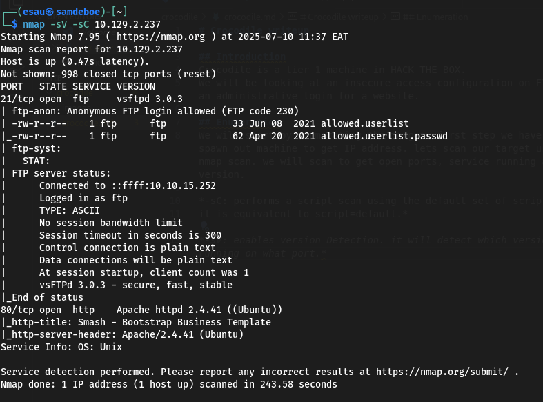

In the above scan we have two open ports: 21and 80. port 21 is dedicated to FTP (file transfer protocal), meaning that its primary use is to transfer files between hosts on the same network.  

When we look to the internet, *FTP is a standard communication protocol used to transfer computer files from a server to a client on a computer network.* FTP users may authenticate themselves with a clear-text sign in protocol, generally using a username and password.  
 However, they can connect anonymously if the server is configured to allow it. this means that we could use it even if we had no valid credentials.  

 When we look back to our Nmap scan result, the FTP server is indeed configured to allow anonymous login.  

 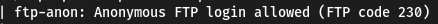    

 If we need to revise the FTP available commands for the FTP service on your localhost we use  *ftp -h*  

 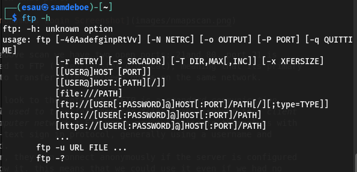.  

##  Foothold via FTP

 To connect to the remote FTP server, you need to specify the targets IP address(hostname). Then it will ask us for our login credentials, which is where we can fill *anonymous* username. 

  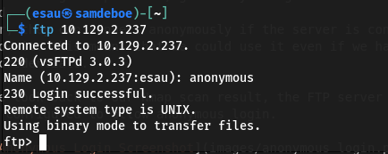

  NOW WE ARE IN...   
  once logged in we can type help command to check the available commands.

   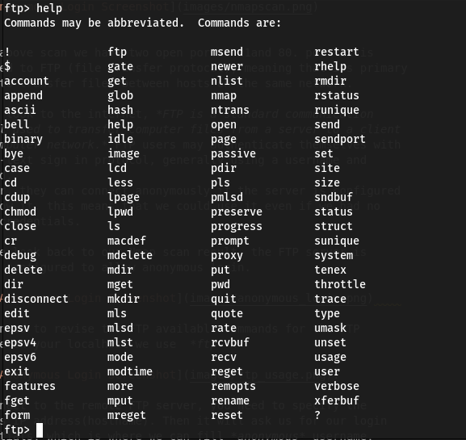 

   We will use *dir* and *get* commands to list the directories and manipulate the files stored on the FTP server.
   *dir*: check the contents of our current directory on the remote host.the two interesting files catch our attention. They seem to be files left over from the configuration of another service on the host, most likely the HTTPD Web server.

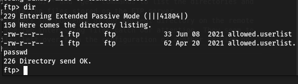 

Both files can be downloaded using *get* command. the FTP service will report the Download status completion back to you during this phase.

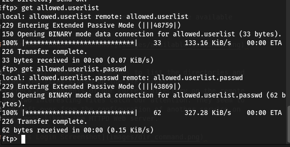 

typing exit command will return the current terminal tab to it's previous state.

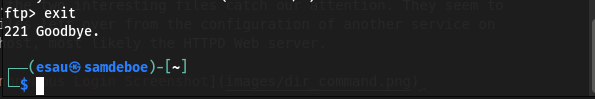 

After exiting the FTP service shell, we can type *ls* command to check if our files are downloaded and are present in out directory. To read their contents we use *cat* command followed by the name of the file we want to open.

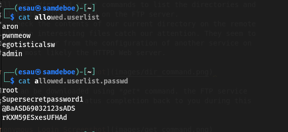 

We can use this credentials obtained to check if they are used in the FTP service for elevated access or web server running in port 80 discovered during Nmap scan.

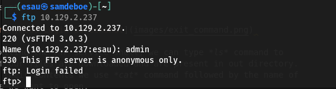 

The FTP server returns error code *530 This FTP server is anonymous only.*

However, during our Nmap scan the service running on port 80 was   *Apache httpd 2.4.41 ((Ubuntu))*.  
Typing the IP address in our browser's URL results in a webpage
 
  

In order to gain more insight into the technology they have used to create their website and possibly find any associated vulnerabilities, we use a handy browser plug-in called *wappalyzer. This plug-in analyzes the web pages codes and return all the different technologies used to build it. To get weppalyser just visit [Wappalyzer Official website](https://www.wappalyzer.com) and download the extension matching your browser.  
Once installed, you can access it by pressing on its icon at the top right of the browser window.

 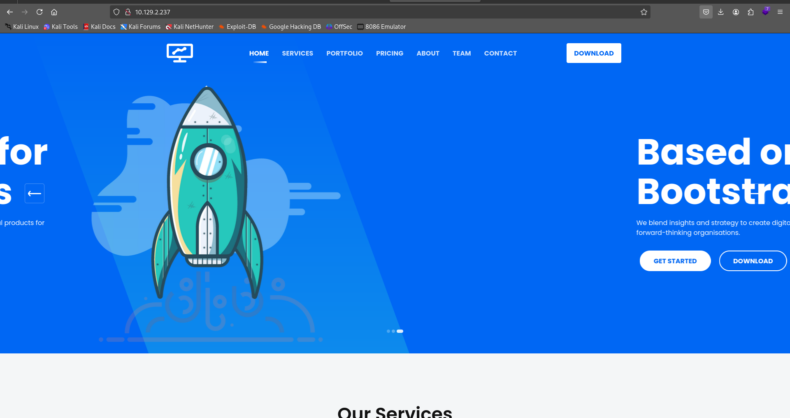 

From the output of wappalyzer, we can note some of interesting items, especially the PHP programming language used to build the web page. However nothing gives us direct plan of attack. 
To access hidden or hardly accessible directories and pages, we use *dir busting*. we will use *gobuster*

##  Privilege Escalation

the following script gives us fastest and most accurate results
**dir :** *uses directory/file enumeration mode.*
**--url :** *The target url.*
**--wordlist :** *path to the wordlist.*
**-x :** *File extension(s) to search for.

For *-x* we can specify php and html to filter all the unneccessary files and directories.the PHP and HTML pages will help us to get **ADMIN** login page where we will use the credentialls we have extracted from FTP server.

 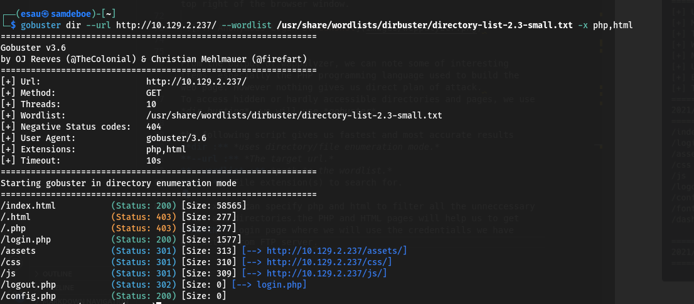 

 in our gobuster results we get the most interesting file **login.php** in */login.php* file. Navigating manually to the URL, in the form of http://(target_IP)/login.php we met with login page asking for username and password combination.

  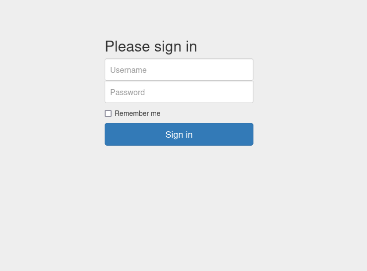 

  If the list of credentials we found had been longer , we could have used a metasploit module or a login brute-force script to run through combination from both lists faster.since we we have a small list lets try logging in mannually. 

  After attempting several username/password combinations, we managed to login and we met with a server manager admin panel, Once here an attacker could manipulate the website in whichever way they desire.
  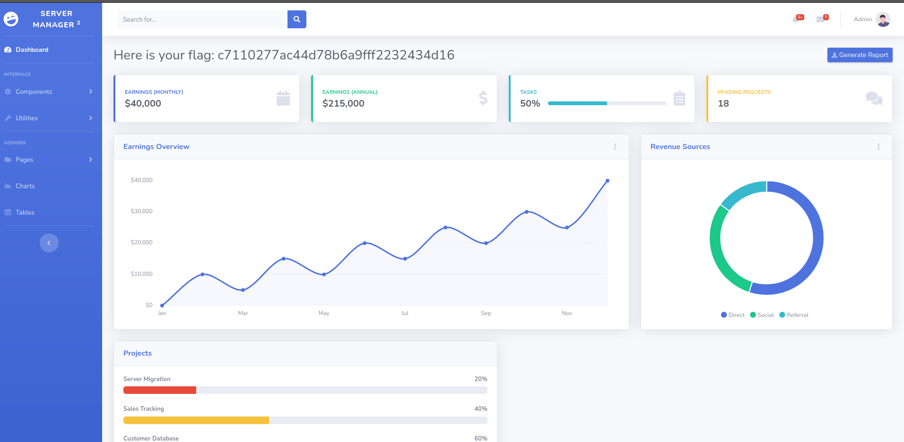 

  ## We have successfully got the flag! 
  It is displayed for us at the top of admin panel.

 

## Conclusion

In this challenge, we exploited an FTP server misconfiguration allowing anonymous login, which exposed credentials used to access a hidden admin login panel on a website. After successful authentication, the flag was displayed in the admin dashboard.

This box demonstrated basic **enumeration**, **information gathering**, **FTP manipulation**, and **web login brute-forcing**. It’s a great exercise in fundamental penetration testing.

## Lessons Learned
- Always check for anonymous login on FTP servers.
- Look inside configuration or leftover files — they often contain secrets.
- Use tools like **Wappalyzer** to identify tech stacks.
- Directory brute-forcing can reveal hidden admin panels.

> 📢 **Disclaimer:** This write-up is for educational purposes only. The techniques demonstrated are used in legal environments such as Hack The Box. Do not attempt unauthorized access on real-world systems.

